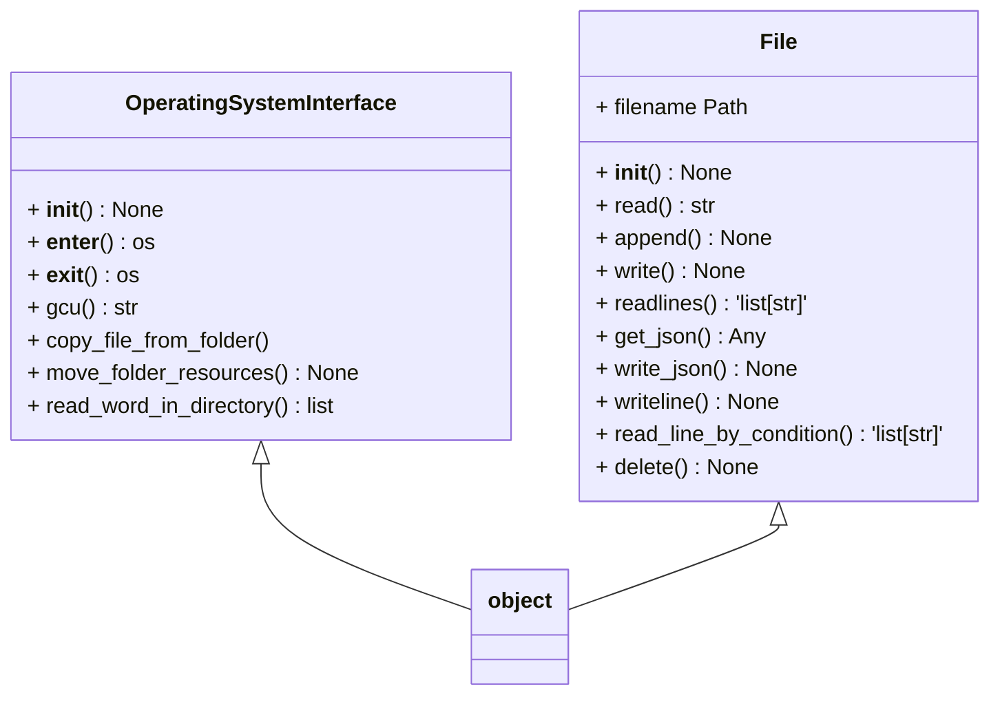

# Jaguar Library 😼

Jaguar is a library for CI/CD, web components, apis and database models

## Design Overview



Improve developer experience through jaguar
- [ ] Make it work on any OS out of the box
- [ ] Change the name of the workflow.py to dev.py and include the operatingSystemInterface and the File object in it
- [ ] Test your code
- [ ] getting a config file, this can be fetched from the web
- [ ] building a virtual environment automatically and installing all the dependencies
- [ ] making the current repository a git repository and push the first commit
- [ ] generating a readme with a custom text
- [ ] Generate .env file in python or typescript
- [ ] Set up a typescript project
- [ ] Turn all the js files to ts files
- [ ] Generate the gitignore, looking at the file extention or the file name
- [ ] Include various github controls command such as branching 

To setup github cli on a linux machine
```linux
curl -fsSL https://cli.github.com/packages/githubcli-archive-keyring.gpg | sudo gpg --dearmor -o /usr/share/keyrings/githubcli-archive-keyring.gpg
echo "deb [arch=$(dpkg --print-architecture) 
signed-by=/usr/share/keyrings/githubcli-archive-keyring.gpg] https://cli.github.com/packages stable main" | sudo tee 
/etc/apt/sources.list.d/github-cli.list > /dev/null
```
```linux
sudo apt update
```
```linux
sudo apt install gh
```
```linux
gh auth login
```
after completing the autorization process
To change the description of the repository 
```linux
gh repo edit https://github.com/kesler20/betting_bot , --description "a script to automatically place bets and analyse them"
```
### A list of potential improvements
- [ ] Create issues automatically on the repo from the cli
- [ ] Resolve those issues 
- [ ] Read those issues and you can print them nicely on the cli
- [ ] Merge a new-feature branch onto the main and delete the new feature branch automatically when all the tests are passed
- [ ] Allow the user to call the help function from their repo, this can be implemented by either using the get requests in python and exposing the service of the cli using fastapi other things like files can also be accessed like this
- [ ] Can you get the list of repos that you have on github from the cli tool

### Workflow.py

using the `workflow.py` file
you can push code by running:

```bash
python workflow.py p
```

One of the main use cases of the workflow.py file could be to share files across different folders
this is becasue if we update iiles which we may want to share across different projects, we could do it only in the jaguar foldr
make sure that it works and then run the following command

```bash

```

The format of the calls are:

```bash
python workflow.py class_name function_name "argument1" "argument2"
```

The last argument is usually the directoy, if you write \* this will apply a function to all directories or also if you leave it black
this will use the current working directory

> If you write "this.py That.js" etc it will apply It to the listed files
> If the function is not found it will just push untested code to github

> If you run -help this should return a list of all the commands and the doc string of the functions and classes that they call

> If you do not enter the arguments to the function, the argument that will be passed is None by default

to start using the `workflow.py` use

```bash
python workflow.py "install"
```

this will copy the current jaguar `os_interface.py` file and the `workflow.py` file in all the repositories in the root protocol folder.

the following table summarizes various commands
| command | Description | Options |
| --- | --- | --- |
| `python workflow.py p ` | push untested code to github with a default message of code: make it better | None |
| `python workflow.py "d changed documentation"` | push code using a custom message | use `"c code change message"/"d document change message"/"t test change message"` |  
| `python workflow.py "push"` | this will run "python workflow.py g" on all the directories in the protocol folder | None |
| `python workflow.py "sync"` | this command will syncronize files from jaguar | standard command `python workflow.py "f interfaces\os_interface.py" "protocol_backend"` anything starting with "f " is considered a file and if the folders preceeding it do not exist this will be created in the repositories given (args withoput the leading "f ")|
| `python workflow.py "git"` | push code to github from a target dir | `p g "target_directory"` to push a new github repo `python workflow.py "git" "init"` to push a new branch `python workflow.py "git" "init" "branch"` |
| `python workflow.py "git" t "py" "t commit message for changing test code"` | runs python tests and pushes to github after asking for permission | py/js for what tests to run - "t "/"c "/"d " for test, code, and document commit messages respectively |
| `python workflow.py aws "init" 1` | initialise an amplify application with notifications category | 1,2,3,4, -> 11 run `python workflow.py "aws" d` to check category ids |
| `python workflow.py aws "edit" 1` | add categories to an existing amplify app | you could also run `python workflow.py "aws" u 1` to remove and add categories for updates |
| `python workflow.py aws "sync" 1` | synchronize .env file with the aws-exports file | None |
| `python workflow.py aws "publish"` | run jest tests, format code, push to github, publish to amplify | None |
| `python workflow.py "aws" d` | describe the categories and best practices | None |
| `python workflow.py "react" "init"` | clone a react project, pull the latest changes, run npm i, run npm start | `python workflow.py "react" "init" "project_name"` |
| `python workflow.py "react" "config"` | create a .env file in the root dir | None |
