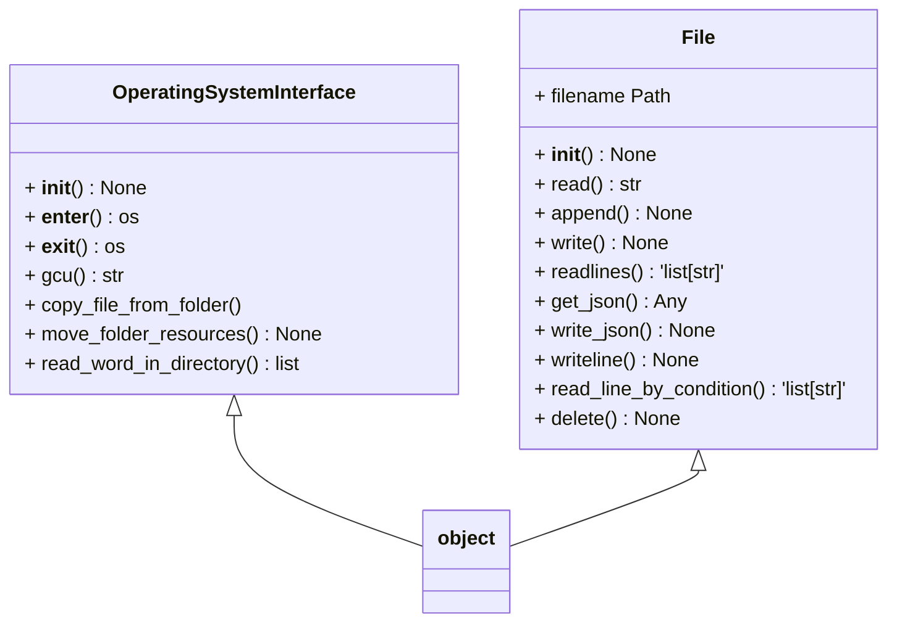

# Design Overview

Improve developer experience through jaguar
	• Make it work on any OS out of the box
	• Change the name of the workflow.py to dev.py and include the operatingSystemInterface and the File object in it
	• Test your code
	• getting a config file, this can be fetched from the web
	• building a virtual environment automatically and installing all the dependencies
	• making the current repository a git repository and push the first commit
	• generating a readme with a custom text
	• Generate .env file in python or typescript
	• Set up a typescript project
	• Turn all the js files to ts files
	• Generate the gitignore, looking at the file extention or the file name
	• Include various github controls command such as branching 

To setup github cli on a linux machine

curl -fsSL https://cli.github.com/packages/githubcli-archive-keyring.gpg | sudo gpg --dearmor -o /usr/share/keyrings/githubcli-archive-keyring.gpg

echo "deb [arch=$(dpkg --print-architecture) 
signed-by=/usr/share/keyrings/githubcli-archive-keyring.gpg] https://cli.github.com/packages stable main" | sudo tee 
/etc/apt/sources.list.d/github-cli.list > /dev/null

sudo apt update

sudo apt install gh

gh auth login

To change the description of the repository 
gh repo edit https://github.com/kesler20/betting_bot , --description "a script to automatically place bets and analyse them"

	• Create issues automatically on the repo from the cli
	• Resolve those issues 
	• Read those issues and you can print them nicely on the cli
	• Merge a new-feature branch onto the main and delete the new feature branch automatically when all the tests are passed
	• Allow the user to call the help function from their repo, this can be implemented by either using the get requests in python and exposing the service of the cli using fastapi other things like files can also be accessed like this

Can you get the list of repos that you have on github from the cli tool
